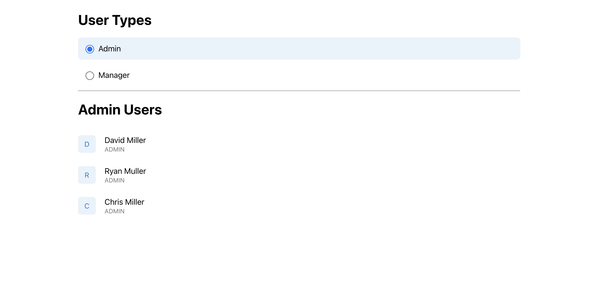
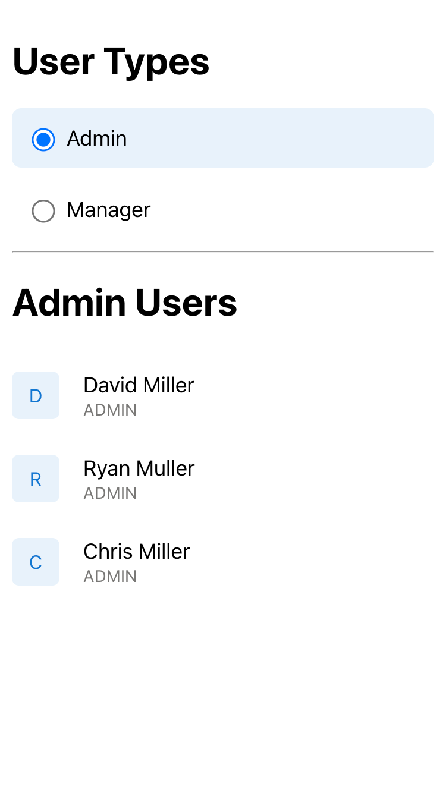

# Zeller Coding Challenge

## Introduction
The challenge requirements can be found in the [Frontend Coding Challenge](./assets/Frontend-Coding-Challenge.pdf) file.
The expected appearance should match the [Zeller Customers Design](./assets/zeller-customers-design.png).

## Getting started
### Prerequisites
To get started with this project, make sure you have the following prerequisites:
1. **Node**: Version 18.12.1 or greater.
  - run `node --version` to check current node version
  - If you need to upgrade or install [NodeJs](http://nodejs.org/) : suggest to install via [Node Version Manager NVM](https://github.com/creationix/nvm)
2. A clone or download of this repo on your local machine

### Installation
Follow these steps to install the necessary dependencies for the project:

1. `cd` to the project root
2. `npm install` to install the npm dependencies

### Running locally
To run the project locally, use the following npm commands:

- `npm start` to start the local development
- `npm run test` to run the unit test
- `npm run test:coverage` to display the test coverage report

## Implementation Details
Here are some key implementation details of this project:

- **Styling**: The application's styles are implemented using `react-styled-components`.
- **Component Organization**: Components are logically split into separate sections.
- **GraphQL Interaction**: React hooks are used for interacting with GraphQL services. You can find details on how to use these hooks in the codebase.
- **Test-Driven Development (TDD)**: Unit tests are written for individual components and hook to ensure code quality and functionality.
- **Environment Variables**: Sensitive credentials and secrets should be stored in an `.env` file to protect them. Make sure not to commit this file to your version control system.

## Project Screenshots

Here are some screenshots that provide a glimpse of the project:

- **UI in the Browser:**
  

- **Responsive Design on Mobile:**
  